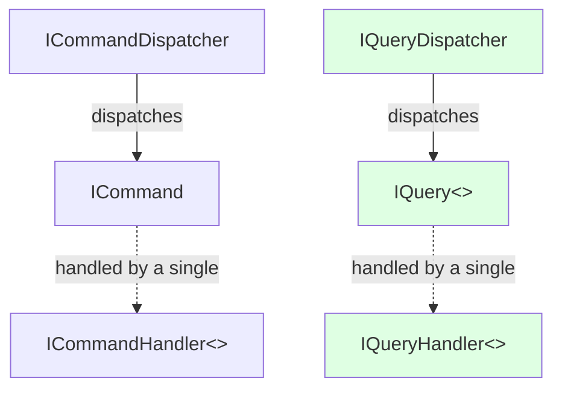
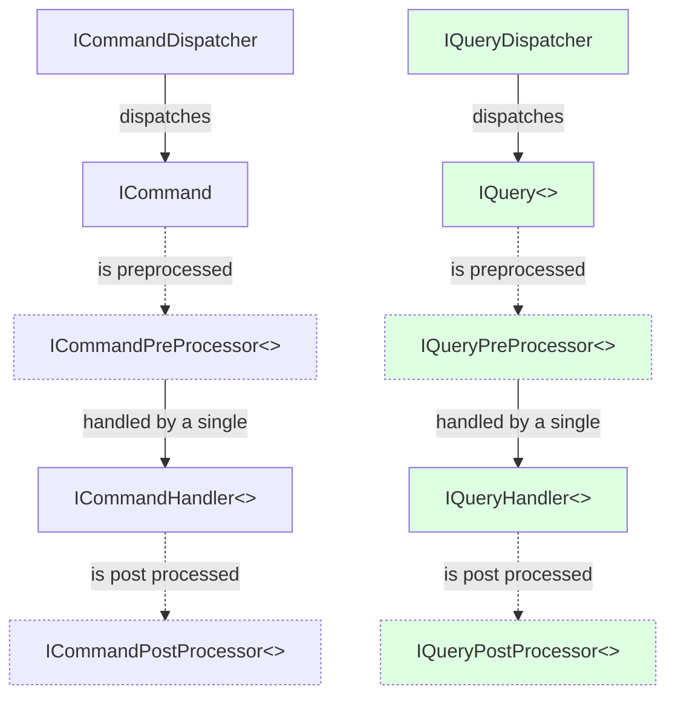

# Crafty.CQRS


&url=https://raw.githubusercontent.com/pierregillon/Crafty.CQRS/main/src/Crafty.CQRS/Crafty.CQRS.csproj)

A simple and crafty library to dispatch command and query to appropriate handlers.

## Only a syntactical sugar on top of the [MediatR library](https://github.com/jbogard/MediatR)

One of the main aspect of **Domain Driven Design**, is to align the language with the domain we want to model.

Why don't we do the same for our technical architecture?

When using **Command and Query Responsability Segregation (CQRS)** pattern, we would love to have Command and Query
defined in our code base, not an implementation details `IRequest` that could be sometimes the first or the second.

This is the purpose of this library: abstract MediatR `IRequest` into `ICommand` and `IQuery`, keeping all features of this library.

## Advantages

All is about **readability** 😌.

- **align the language**: stop using the "request" keyword when you are doing CQRS
- **everything is based on interfaces** (thanks to default implementation in interface) : 
  - you prefer a record for you command and your handler? Please do it, you have no limitation.
  - you want to implement multiple handling in a single class? please do it. 
- **simplify**: remove `CancellationToken` from `Handle()` method.
  - most of process cannot be cancelled (or we don't want to implement a cancellation process).
- **simplify bis**: hide the `Unit.Value` concept of MediatR

## Schema of the 2 flows



## Show me code, no talk.

### Installation

```csharp
services
    .AddCqrs(options => options.RegisterServicesFromAssemblyContaining<XXX>())
```

### Command dispatching from api controller

```csharp
public class UserController : ControllerBase
{
    private ICommandDispatcher _commandDispatcher;
    
    public UserController(ICommandDispatcher commandDispatcher) => _commandDispatcher = commandDispatcher;
  
    [HttpPost]
    public async Task<IActionResult> RegisterUser()
    {
        await _commandDispatcher.Dispatch(new RegisterUserCommand());
    }
}
```

The command :
```csharp
public record RegisterUserCommand : ICommand;
```

The handler :
```csharp
public record RegisterUserCommandHandler : ICommandHandler<RegisterUserCommand>
{

    public Task Handle(RegisterUserCommand command)
    {
        ...
    }
}
```

### Query dispatching from api controller

```csharp
public class UserController : ControllerBase
{
    private IQueryDispatcher _queryDispatcher;
    
    public UserController(IQueryDispatcher queryDispatcher) => _queryDispatcher = queryDispatcher;
  
    [HttpPost]
    public async Task<IActionResult> ListAllRegisteredUsers()
    {
        var users = await _queryDispatcher.Dispatch(new ListAllRegisteredUsersQuery());
        
        return Ok(users);
    }
}
```

The query :
```csharp
public record ListAllRegisteredUsersQuery : IQuery<IEnumerable<UserListItem>>;
```

The handler :
```csharp
public record ListAllRegisteredUsersQueryHandler : IQueryHandler<ListAllRegisteredUsersQuery, IEnumerable<UserListItem>>
{

    public Task<IEnumerable<UserListItem>> Handle(ListAllRegisteredUsersQuery query)
    {
        ...
    }
}
```

## And ... cancellation?

In certain case, if you want to access the `CancellationToken` in an handler, 
you can implement `ICommandCancellableHandler` or `IQueryCancellableHandler`, that add the token as a second parameter.

```csharp
public record RegisterUserCommandHandler : ICommandCancellableHandler<RegisterUserCommand>
{

    public Task Handle(RegisterUserCommand command, CancellationToken token)
    {
        ...
    }
}
```

## Using processors

You can implement `ICommandPreProcessor` and `ICommandPostProcessor` to interact before and after the `ICommandHandler`.
The same can be achieved for queries.


